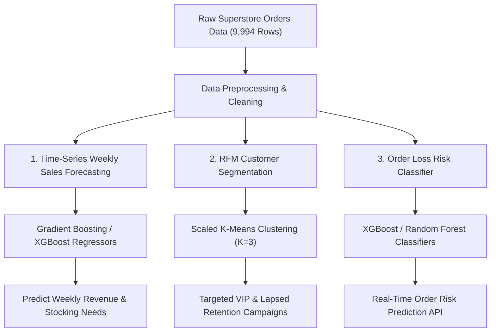

# 🛒 E-Commerce Sales Analytics & Machine Learning Intelligence Suite

[](https://www.python.org/)
[](https://flask.palletsprojects.com/)
[](https://xgboost.readthedocs.io/)
[](https://scikit-learn.org/)
[](https://www.mysql.com/)

An end-to-end **Data Science, Data Analytics, and Machine Learning project** built on Superstore E-Commerce transactional data (~10,000 order records across 793 unique customers). 

This repository features **SQL Data Modeling**, **Exploratory Data Analysis (EDA)**, **3 Production-Grade Machine Learning Models**, and a **Real-Time Interactive Web Application Dashboard**.

---

## 📌 Executive Summary & Key Results

| Component | Technology | Key Highlight / Performance Metric |
| :--- | :--- | :--- |
| **Data Ingestion & SQL** | MySQL 8.0 | Relational schema (`superstore_sales.orders`), date format casting, YoY Growth via `LAG()` |
| **Sales Forecasting** | Gradient Boosting Regressor | **MAE: $4,505.86**, **RMSE: $5,948.81**, **$R^2 = 0.4319$** on weekly sales streams |
| **Customer Segmentation** | RFM + K-Means Clustering | Segmented 793 customers into 3 Personas: *Champions/VIPs*, *Loyal*, *Lapsed/At-Risk* |
| **Order Loss Predictor** | XGBoost Classifier | **95.05% Accuracy**, **93.10% Precision**, **0.8571 F1-Score**, **0.9883 ROC-AUC** |
| **Web Dashboard** | Flask + Vanilla JS + ApexCharts | Real-time ML inference engine running at `http://127.0.0.1:5000` |

---

## 🤖 Machine Learning Solutions Architecture



---

## 🛠️ Machine Learning Model Performance

### 📈 Task 1: Time-Series Weekly Sales Forecasting (Regression)
* **Goal**: Forecast weekly revenue streams to optimize inventory management and stock level allocation.
* **Feature Engineering**: Generated temporal calendar metrics (*Year, Month, Quarter, Week of Year*), multi-period lag metrics (*1, 2, 3, 4, 8, 12 weeks*), and rolling statistical windows (*4, 8, 12 weeks*).
* **Train/Test Split**: Chronological 80/20 split.

#### Model Comparison Table

| Model | MAE ($) | RMSE ($) | R² Score | Performance Rank |
| :--- | :---: | :---: | :---: | :--- |
| **Gradient Boosting Regressor** | **$4,505.86** | **$5,948.81** | **0.4319** | 🥇 **Best Model** |
| Linear Regression | $4,808.73 | $6,081.79 | 0.4062 | 🥈 Strong Baseline |
| Random Forest Regressor | $4,683.78 | $6,447.56 | 0.3327 | 🥉 Moderate |
| XGBoost Regressor | $5,442.42 | $7,054.72 | 0.2011 | Overfitted |

---

### 👥 Task 2: RFM Customer Segmentation (K-Means Clustering)
* **Goal**: Categorize 793 customers based on **Recency** (days inactive), **Frequency** (total orders), and **Monetary** (total spend).
* **Clustering Algorithm**: Standard Scaler + K-Means with Silhouette Analysis ($K = 3$).

#### Customer Persona Summary

| Persona | Customer Count | Avg Recency | Avg Frequency | Avg Monetary Spend | Strategic Action |
| :--- | :---: | :---: | :---: | :---: | :--- |
| 🌟 **Champions / VIPs** | 269 | 80.3 days | 8.84 orders | **$5,140.99** | Premium loyalty rewards & early access |
| 💙 **Loyal / High Spend** | 413 | 88.7 days | 5.36 orders | **$1,773.81** | Upsell & cross-category recommendations |
| ⚠️ **Lapsed / At Risk** | 111 | 531.4 days | 3.77 orders | **$1,636.86** | Win-back discount email campaigns |

---

### ⚠️ Task 3: Order Profitability & Loss Classification (Supervised Binary ML)
* **Goal**: Predict whether an order will yield a financial loss (`Profit < 0`) before fulfillment.
* **Target Distribution**: 18.7% of total dataset orders were unprofitable due to discount rates > 20%.

#### Classifier Performance Comparison

| Model | Accuracy | Precision | Recall | F1-Score | ROC-AUC | Deployment |
| :--- | :---: | :---: | :---: | :---: | :---: | :--- |
| **XGBoost Classifier** | **95.05%** | **93.10%** | **79.41%** | **0.8571** | **0.9883** | 🥇 **Deployed to Web API** |
| Random Forest Classifier | 95.00% | 91.27% | 81.02% | 0.8584 | 0.9846 | High Recall |
| Logistic Regression | 94.35% | 93.07% | 75.40% | 0.8331 | 0.9862 | Linear Baseline |

> **Key Root Cause Finding**: Feature importance analysis confirms **Discount Rate** is by far the #1 driver of loss-making orders, followed by total **Sales value** and sub-categories (**Tables**, **Bookcases**).

---

## 🌐 Real-Time Interactive Web Dashboard

The Flask web application serves both an interactive glassmorphic dashboard interface and real-time Machine Learning API inference endpoints.

### Dashboard Sections:
1. **Executive Overview**: Real-time KPI summary cards ($2.30M Revenue, $286.4K Profit, 12.47% Margin, 18.7% Loss Rate) & category breakdown charts.
2. **Sales Forecasting Simulator**: Dynamic ApexCharts weekly revenue stream forecast with interactive model selector.
3. **RFM Persona Explorer**: Recency vs Spend scatter plot with cohort metric cards.
4. **Order Loss Risk Predictor**: Interactive input form with sliders for Discount %, Sales, Quantity, Sub-Category, and Region. Uses live XGBoost ML inference to output loss risk percentage and recommendations.

---

## 🗂️ Project Repository Structure

```
├── app.py                      # Flask Web Application & Real-Time ML API
├── ml_pipeline.py              # Modular Python batch training pipeline for all 3 ML models
├── e_commerce.ipynb            # Jupyter Notebook with complete EDA, SQL, & ML cells
├── e commerce sales.sql        # MySQL database schema, ETL, and window function queries
├── Sample - Superstore.csv     # E-Commerce transactional dataset
├── templates/
│   └── index.html              # Glassmorphic single-page web dashboard UI
├── static/
│   ├── css/style.css           # Modern dark-mode glassmorphic styling
│   └── js/main.js              # ApexCharts visualizations & live API integration
├── weekly_sales_forecasting.png
├── customer_segmentation_rfm.png
├── loss_classification_features.png
└── README.md
```

---

## 🚀 Quick Start & Installation

### 1. Clone Repository & Install Dependencies
```bash
git clone https://github.com/palavinash16/DATA-ANALYSIS-PROJECT.git
cd "E commerce sales analysis"
pip install pandas numpy scikit-learn xgboost flask matplotlib seaborn plotly
```

### 2. Run Machine Learning Pipeline
```bash
python ml_pipeline.py
```

### 3. Launch Web Application Dashboard
```bash
python app.py
```
Open **[http://127.0.0.1:5000](http://127.0.0.1:5000)** in your browser.

---

## 👨‍💻 Author & Attribution
* **Avinash Kumar Pal**
* GitHub Repository: [palavinash16/DATA-ANALYSIS-PROJECT](https://github.com/palavinash16/DATA-ANALYSIS-PROJECT)
* License: MIT
